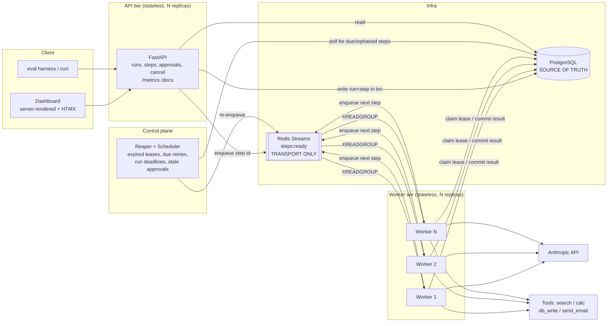
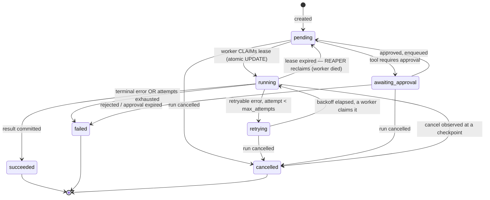
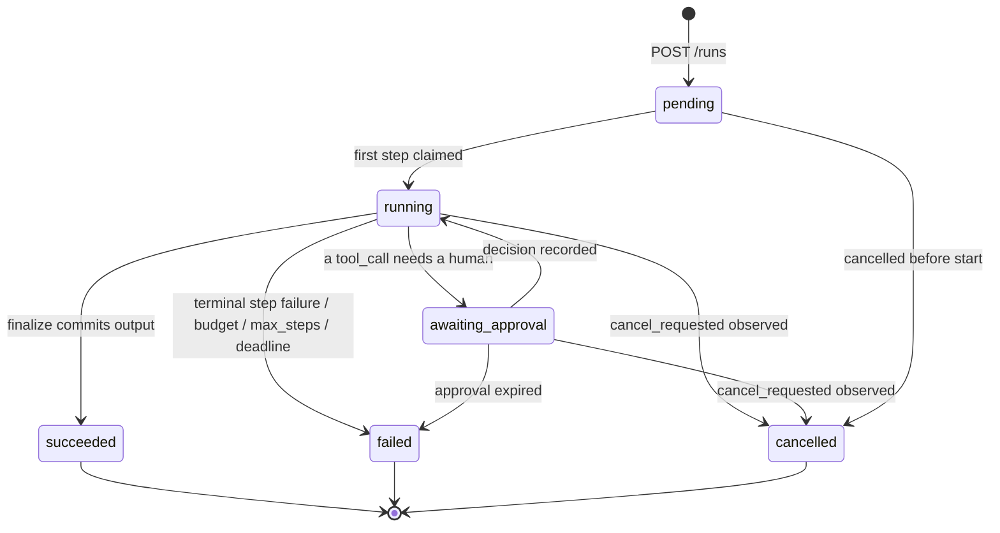

# DESIGN.md — Agent Orchestration Engine

> **Status: Phase 4 of 6 complete (core engine, LLM loop, tools, idempotency,
> approvals, guardrails).** Phases 5-6 are still design.
> This document is the contract for everything that follows. Decisions marked **[TRADE-OFF]**
> are ones where a defensible alternative exists; they are called out rather than silently picked.
> Where implementation changed a decision, the entry is marked **[TRADE-OFF, revised in Phase N]**
> rather than quietly rewritten.

---

## 1. What this system is

A durable execution engine for LLM agents. You submit a task; the engine runs a ReAct-style
loop (plan → call tool → observe → repeat) where **every state transition is committed to
Postgres before it is acted on**. Workers are stateless and disposable. If a worker is killed
mid-run, another worker picks the run up exactly where it stopped — without re-running
completed LLM calls or duplicating side effects.

The interesting part is not the agent loop. It is the reliability layer underneath it:
leases, fencing, idempotent effects, retry classification, and approval gates.

### Non-goals (stated so scope stays honest)
- Not a general workflow engine — no arbitrary DAGs, no child workflows, no external signals.
- Not multi-tenant. No auth beyond a static API key. No RBAC on approvals.
- Not distributed-transaction safe across external systems. We do idempotency, not 2PC.

---

## 2. Architecture



### The central invariant

> **Postgres is the source of truth. Redis is a latency optimization and is allowed to lose
> everything.**

A step is runnable if and only if this SQL says so:

```sql
status IN ('pending','retrying')
  AND available_at <= now()
  AND (lease_expires_at IS NULL OR lease_expires_at < now())
```

Redis tells a worker *quickly* that a step is runnable. The reaper's poll of that same
predicate is the safety net that makes correctness independent of Redis. Flush Redis mid-run
and the system self-heals within one poll interval. This is why crash recovery, delayed
retries, and lost-message recovery are all **one mechanism** instead of three.

**[TRADE-OFF] Why not make Redis authoritative, or drop it entirely?**
- *Redis-authoritative* (the consumer-group PEL as the work ledger): fewer moving parts, but the
  agent's business state has to live in Postgres regardless, so you end up with two sources of
  truth that can disagree. Rejected.
- *Postgres-only* (`SELECT ... FOR UPDATE SKIP LOCKED` polling, no Redis): genuinely viable and
  simpler — this is what most people should build. Rejected as the default because at low poll
  intervals it burns real DB CPU, and because a stream with consumer groups is closer to the
  production topology this project is modeling. But since the poller exists anyway, Postgres-only
  is a config flag (`QUEUE_BACKEND=postgres`). I'll ship it as a supported fallback; it doubles as
  a live proof that Redis is not load-bearing for correctness.

### Where Kafka would drop in, and why not now

Redis Streams and Kafka expose the same shape here: append-only log, consumer groups,
at-least-once delivery, explicit ack, claim of stalled entries (`XAUTOCLAIM` ≈ rebalance).
The queue sits behind a `StepQueue` port with `publish` / `consume` / `ack` / `reclaim_stalled`,
so the swap is one adapter.

Switch to Kafka when:

| Pressure | Redis Streams | Kafka |
|---|---|---|
| Throughput > ~50–100k msg/s | single-shard ceiling; Cluster shards by key but a stream doesn't split | partitions scale horizontally by design |
| Backlog larger than RAM | streams live in memory; a stuck group grows the PEL until OOM | disk-resident log, retention by time/size |
| Durability | AOF `everysec` → up to 1s of acked writes lost on node loss | `acks=all` + ISR replication |
| Replay / audit of the work log | `XRANGE` works, retention is manual `XTRIM` | offsets and compaction are first-class |
| Extra consumers (analytics, DLQ) | compete for the same memory | cheap, independent offsets |

At this project's scale (single-digit thousands of steps/min), Kafka's operational cost —
KRaft quorum, rebalance latency on every deploy, consumer-lag monitoring — buys nothing.
**And because Postgres is the ledger, losing 1s of Redis writes is not a correctness bug, only a
latency bug** — the reaper recovers those steps. That is exactly why Redis is acceptable here and
would not be if the queue were authoritative.

---

## 3. Execution model

### One step = one unit of durable work

**[TRADE-OFF] Step granularity.** Two options:
- (A) one Step = one full ReAct iteration (the LLM decision *and* its tool call)
- (B) one Step = one LLM turn **or** one tool call ← **chosen**

(B) costs more rows and more queue hops. It buys the thing this project exists to demonstrate: if
a worker dies after the model has answered but before the tool ran, (A) must re-pay for the LLM
call — money, latency, and a non-deterministic re-plan. With (B) that turn is already `succeeded`
and durable, and recovery resumes at the tool call. Crash recovery is only interesting at a
granularity finer than "the expensive part."

### Step kinds

| kind | what it does | side effects |
|---|---|---|
| `agent_turn` | derive messages from persisted state, call Claude with tools, persist the response. Emits `tool_use` blocks or a final answer. | LLM spend only |
| `tool_call` | execute exactly one tool with validated args under an idempotency key | possibly external |
| `finalize` | persist run output, close the run | none |

### Run serialization invariant

> **At most one non-terminal step exists per run at any time.**

Enforced by a partial unique index (§6). Each run is therefore a strictly serial state machine:
no intra-run races, no join/barrier logic, no partial-fan-out recovery. Parallelism lives *across*
runs, which is where it actually matters for throughput.

**[TRADE-OFF] Parallel tool calls.** Claude can emit several `tool_use` blocks in one turn. The
schema supports it (`steps.parent_step_id` + sibling rows), but v1 executes siblings
**sequentially** in response order. Parallel execution needs a barrier step and a partial-failure
policy — real complexity for a latency win that doesn't matter at this scale. Deferred, not
designed out.

### The transcript is derived, never stored twice

The `messages` array sent to Claude is a **pure function of the run's persisted steps**:

```
build_messages(run) = [user: task]
                    + for each succeeded agent_turn: assistant(content blocks)
                    + for each terminal tool_call:   user(tool_result blocks)
```

No separate conversation table to drift out of sync with the state machine. A worker that picks
up a recovered run reconstructs identical context. Raw provider request/response JSON is still
persisted in `llm_calls` for debugging — but it is **evidence, not state**.

---

## 4. State machines

### Step



Terminal: `succeeded`, `failed`, `cancelled`. Everything else is resumable.

**[TRADE-OFF, revised in Phase 2]** `retrying` is claimable *directly*, rather than
passing through `pending` when its backoff elapses. The extra hop would have added one
reaper interval of latency to every retry and introduced a state with no observable
meaning of its own — `retrying` already means "failed, waiting out its backoff,
claimable once `available_at` passes". The claim predicate accepts
`status IN ('pending','retrying')` and the transition table permits `retrying -> running`.

Note `running --> pending` rather than `running --> retrying`: a worker death is **not** a step
failure and must not consume the retry budget the same way. It increments `attempt` (the effect
may have partially happened) but is recorded with `reason='lease_expired'` and is governed by
`max_recoveries`, a separate counter. Otherwise a poison step that reliably kills its worker
would silently burn the user's retry budget and mask the real bug.

### Run



**[TRADE-OFF]** Runs deliberately have no `retrying` state (the brief listed one state set for
both entities). Retry is a step-level concern; a run between step attempts is still `running`.
Surfacing `retrying` at the run level would make "is this run alive?" ambiguous for the dashboard
and for metrics, and the retry is already fully visible in the step timeline.

Timeouts and budget exhaustion resolve to `failed` with a structured
`error.code ∈ {deadline_exceeded, budget_exceeded, max_steps_exceeded, ...}` rather than becoming
separate top-level states — that keeps terminal-state handling closed at three cases.

### Legal transitions live in exactly one place

A single `TRANSITIONS: dict[Status, set[Status]]` table, checked inside `transition()`, which is
the **only** function permitted to write a status column. It writes the row and appends to
`state_transitions` in the same transaction; an illegal transition raises. That makes the diagrams
above executable documentation rather than aspiration, and yields the audit log for free.

---

## 5. Reliability mechanisms

### 5.1 Lease acquisition — why two workers can't run one step

```sql
UPDATE steps
   SET status = 'running',
       attempt = attempt + 1,
       lease_owner = :worker_id,
       lease_epoch = lease_epoch + 1,          -- fencing token
       lease_expires_at = now() + :lease_ttl,
       started_at = COALESCE(started_at, now())
 WHERE id = :step_id
   AND status IN ('pending','retrying')
   AND available_at <= now()
   AND (lease_expires_at IS NULL OR lease_expires_at < now())
RETURNING *;
```

One atomic statement; Postgres row locks serialize contenders. Zero rows returned means someone
else owns it, so the worker `XACK`s and moves on. That is the entire duplicate-execution defense,
and the multi-worker test asserts on it directly.

**Fencing.** A worker stalled by a GC pause, a network partition, or a suspended laptop can wake
up *after* its lease expired and after another worker already re-ran the step. Its late write must
not land. So **every** subsequent write by that worker carries:

```sql
WHERE id = :step_id AND lease_owner = :worker_id AND lease_epoch = :epoch
```

Zero rows matched ⇒ the worker knows it was fenced: it discards its result, logs `fenced=true`,
and does not ack. This is the failure mode most naive lease implementations miss, and it's
directly testable by forging an epoch.

**Heartbeat.** While executing, the worker extends `lease_expires_at` from a background task at
`lease_ttl / 3`. If the heartbeat cannot extend (fenced, or DB unreachable), the worker **cancels
the in-flight work** rather than continuing to run unowned.

`lease_ttl` must exceed the slowest legitimate step (a long LLM call). Defaults: `lease_ttl=60s`,
heartbeat 20s, reaper poll 5s. Detection latency on a hard kill ≈ `lease_ttl`.

### 5.2 Idempotency — and a correction to the brief

The brief specifies an idempotency key derived from `(run_id, step_id, attempt)`.
**Including `attempt` defeats the purpose.** This is worth being precise about, because it is the
whole point of the feature:

> The dangerous case is an *ambiguous failure*: the tool sent the email, then the connection
> dropped before success was recorded. On retry, a key containing `attempt` is a **different**
> key, so the dedupe store has no memory of the first attempt — and the customer gets two emails.

So the **effect key is `sha256(run_id, step_id, tool_name, canonical_json(args))` — stable across
attempts.** `attempt` is carried as observability metadata and in downstream request headers,
never in the dedupe key. (Args are in the key so a step whose args somehow changed is treated as a
different effect; in practice args are frozen at step creation.)

The `tool_calls` table **is** the effect ledger, with `UNIQUE(idempotency_key)`. Three phases:

```
1. CLAIM    INSERT ... ON CONFLICT (idempotency_key) DO NOTHING RETURNING id
            inserted                       -> effect_status='in_flight', go to 2
            conflict, row is 'committed'   -> return stored result, DO NOT re-execute
            conflict, row is 'in_flight'   -> AMBIGUOUS, see below
2. EXECUTE  run the tool (the external side effect happens here)
3. COMMIT   UPDATE ... SET effect_status='committed', result=:r
            WHERE id=:id AND effect_status='in_flight'
```

**Ambiguous `in_flight` recovery — a case that needs a policy, not a trick.** We cannot know
whether the effect happened. Each tool declares:

| policy | meaning | tools |
|---|---|---|
| `SAFE_TO_REPLAY` | naturally idempotent (upsert by key, pure computation, GET) | `calculator`, `web_search`, `database_write` |
| `REQUIRES_PROVIDER_KEY` | downstream dedupes on the key we pass (Stripe-style `Idempotency-Key`) | `send_email` |
| `UNSAFE_TO_REPLAY` | no dedupe available → fail the step `error.code=ambiguous_effect`, surface for human review | escape hatch for a fire-and-forget tool |

The honest claim: **exactly-once effects are impossible without downstream cooperation. What we
guarantee is at-most-once per effect key, plus a machine-readable record of every ambiguity.**
The mock email provider maintains its own `Idempotency-Key → message_id` map, so the test can kill
the worker between EXECUTE and COMMIT, let the reaper reassign, and assert
`provider.sent_count == 1` with the step ultimately `succeeded`.

### 5.3 Retry policy

Per-step policy resolved from the agent definition plus a per-tool override: `max_attempts`,
`initial_backoff_s`, `backoff_multiplier`, `max_backoff_s`, full jitter. A retry sets
`status='retrying'` and `available_at = now() + backoff`, and releases the lease. The scheduler
picks it up when due — **no in-process sleep**, so a pending retry survives a worker restart.

Error classification is explicit; never `except Exception: retry`:

| class | examples | action |
|---|---|---|
| **Retryable** | timeouts, connection reset, HTTP 429/5xx, Anthropic `overloaded_error`, DB deadlock | backoff + retry; honor `Retry-After` |
| **Terminal** | schema-invalid tool args, unknown tool, non-429 4xx, auth failure, guardrail breach | fail immediately, no retry |
| **Ambiguous** | timeout *after* a side-effecting request was sent | §5.2 policy table |

**Malformed model output is a special retryable.** If Claude emits args that fail Pydantic
validation we do **not** fail the run: we append a `tool_result` with `is_error: true` carrying the
validation message and let the model correct itself on the next `agent_turn` — capped by
`max_consecutive_invalid_tool_calls` (default 3) so a confused model can't spin the budget. Model
self-correction is a retry mechanism in the same way network backoff is.

Backoff granularity is bounded below by the scheduler poll interval (5s). Sub-second retries would
need a Redis ZSET of due timestamps — noted, not needed.

### 5.4 Crash recovery — the demo you can run

`scripts/demo_crash_recovery.py`:

1. Start 2 workers; submit a run whose step 3 is `send_email` (`REQUIRES_PROVIDER_KEY`).
2. Block until the email effect has been performed but **before** it commits — via a deterministic
   `CRASH_AFTER_EFFECT` fault-injection hook, not a `sleep` race.
3. `SIGKILL` that worker (`-9`: no cleanup, no lease release — that is the point).
4. Observe: lease expires → reaper transitions the step `running → pending` (reason
   `lease_expired`) → the other worker claims it → CLAIM hits the `in_flight` row →
   `REQUIRES_PROVIDER_KEY` path → provider returns the *stored* `message_id` → step `succeeded`.
5. Assert: `emails_sent == 1`; steps 1–2 still have `attempt == 1` and were never re-executed; the
   run reaches `succeeded`.

The script prints the step timeline and the `state_transitions` audit trail so the handoff is
*visible*, not asserted in prose.

### 5.5 Approval gates

`ToolSpec.requires_approval` is either `True` or a predicate over args. v1: `send_email` always;
`database_write` when the target table is in a configured sensitive set — which proves approval can
be **data-dependent**, not merely tool-dependent.

Such a `tool_call` step is created directly in `awaiting_approval` and is **never enqueued**; the
run also moves to `awaiting_approval`, so the dashboard's approval queue is one indexed query.

`POST /approvals/{id}/decision {"decision":"approve"|"reject","reason","decided_by"}` →
transactionally records the decision, transitions the step to `pending`, the run back to `running`,
and enqueues. Idempotent: a second decision on a decided request returns `409` with the existing
decision.

**[TRADE-OFF] Rejection semantics.** Either (a) rejection kills the run, or (b) rejection feeds
`tool_result{is_error, "rejected by <who>: <reason>"}` back to the model so it can adapt.
**Chosen: (b)** — it makes an approval gate a *steering* mechanism rather than a kill switch, and
it is strictly more expressive since a run can still be killed via `POST /runs/{id}/cancel`.
Configurable per definition as `on_approval_rejected`.

Approvals carry `expires_at`; the reaper expires stale ones so a run can't hang forever.

### 5.6 Guardrails

| guardrail | enforced where | on breach |
|---|---|---|
| `max_steps` | before creating the next step | one final answer attempt with tools disabled, then `failed`/`max_steps_exceeded` |
| `max_cost_usd` | before each LLM call, against `runs.cost_usd` | run `failed`, `budget_exceeded` |
| `deadline_at` (wall clock) | worker checkpoint + reaper sweep | run `failed`, `deadline_exceeded` |
| `max_consecutive_invalid_tool_calls` | after arg validation | run `failed`, `model_output_invalid` |
| `max_recoveries` per step | reaper | step `failed`, `too_many_recoveries` (poison-pill guard) |

**[TRADE-OFF] Budget is checked *before* a call, not enforced *during* one**, so the last call can
overshoot by at most `max_tokens` of output. Hard enforcement would require streaming with a
mid-stream abort — real complexity, and the overshoot is bounded and cheap. Documented, not hidden.

### 5.7 Cancellation

Cooperative. `POST /runs/{id}/cancel` sets `cancel_requested=true`; non-running steps go straight
to `cancelled`. A running step observes the flag at checkpoints (before tool execution, on each
heartbeat) and aborts. **We deliberately do not interrupt an in-flight side effect** — killing a
worker mid-`send_email` is precisely the ambiguity this system exists to avoid creating. Cancel
means "stop soon and safely," and the API docs will say so.

---

## 6. Schema

Postgres 16. UUID PKs (v7-style, time-ordered, for index locality). `timestamptz` everywhere, UTC.
JSONB for open payloads. Money as `numeric(12,6)` — never float.

```sql
-- ---------- enums ----------
CREATE TYPE run_status  AS ENUM ('pending','running','awaiting_approval','succeeded','failed','cancelled');
CREATE TYPE step_status AS ENUM ('pending','running','retrying','awaiting_approval','succeeded','failed','cancelled');
CREATE TYPE step_kind   AS ENUM ('agent_turn','tool_call','finalize');
CREATE TYPE effect_status AS ENUM ('in_flight','committed','abandoned');
CREATE TYPE approval_decision AS ENUM ('pending','approved','rejected','expired');

-- ---------- agent_definitions : immutable, versioned ----------
CREATE TABLE agent_definitions (
    id              uuid PRIMARY KEY,
    name            text NOT NULL,
    version         int  NOT NULL,
    system_prompt   text NOT NULL,
    model           text NOT NULL,                      -- e.g. claude-sonnet-5
    tools           text[] NOT NULL DEFAULT '{}',       -- resolved against the tool registry
    max_steps       int    NOT NULL DEFAULT 20  CHECK (max_steps BETWEEN 1 AND 200),
    max_cost_usd    numeric(12,6) NOT NULL DEFAULT 1.0 CHECK (max_cost_usd > 0),
    timeout_seconds int    NOT NULL DEFAULT 900 CHECK (timeout_seconds > 0),
    retry_policy    jsonb  NOT NULL DEFAULT '{}'::jsonb,
    on_approval_rejected text NOT NULL DEFAULT 'feed_back_to_model',
    created_at      timestamptz NOT NULL DEFAULT now(),
    UNIQUE (name, version)
);
-- Never updated in place; a change is a new version. Runs pin a version, so a run's behavior is
-- reproducible months later and a config edit cannot retroactively alter an in-flight run.

-- ---------- agent_runs ----------
CREATE TABLE agent_runs (
    id                   uuid PRIMARY KEY,
    agent_definition_id  uuid NOT NULL REFERENCES agent_definitions(id),
    status               run_status NOT NULL DEFAULT 'pending',
    task                 text  NOT NULL,
    input                jsonb NOT NULL DEFAULT '{}'::jsonb,
    output               jsonb,
    error                jsonb,                         -- {code, message, details}
    client_idempotency_key text,                        -- caller-supplied; dedupes run creation
    cancel_requested     boolean NOT NULL DEFAULT false,
    -- guardrail snapshot, copied from the definition at creation
    max_steps            int NOT NULL,
    max_cost_usd         numeric(12,6) NOT NULL,
    deadline_at          timestamptz NOT NULL,
    -- rollups, incremented in the same txn as the writes that cause them
    steps_used           int    NOT NULL DEFAULT 0,
    input_tokens         bigint NOT NULL DEFAULT 0,
    output_tokens        bigint NOT NULL DEFAULT 0,
    cache_read_tokens    bigint NOT NULL DEFAULT 0,
    cache_write_tokens   bigint NOT NULL DEFAULT 0,
    cost_usd             numeric(12,6) NOT NULL DEFAULT 0,
    created_at  timestamptz NOT NULL DEFAULT now(),
    started_at  timestamptz,
    ended_at    timestamptz,
    updated_at  timestamptz NOT NULL DEFAULT now()
);
CREATE UNIQUE INDEX ON agent_runs (client_idempotency_key) WHERE client_idempotency_key IS NOT NULL;
CREATE INDEX ON agent_runs (status, created_at DESC);
CREATE INDEX ON agent_runs (deadline_at) WHERE status IN ('pending','running','awaiting_approval');

-- ---------- steps ----------
CREATE TABLE steps (
    id             uuid PRIMARY KEY,
    run_id         uuid NOT NULL REFERENCES agent_runs(id) ON DELETE CASCADE,
    seq            int  NOT NULL,                       -- monotonic within run
    parent_step_id uuid REFERENCES steps(id),           -- tool_call -> the agent_turn that emitted it
    kind           step_kind   NOT NULL,
    status         step_status NOT NULL DEFAULT 'pending',
    input          jsonb NOT NULL DEFAULT '{}'::jsonb,
    output         jsonb,
    error          jsonb,
    -- retry / recovery
    attempt        int NOT NULL DEFAULT 0,
    max_attempts   int NOT NULL DEFAULT 3,
    recoveries     int NOT NULL DEFAULT 0,              -- lease expirations, budgeted separately
    max_recoveries int NOT NULL DEFAULT 2,
    available_at   timestamptz NOT NULL DEFAULT now(),  -- backoff gate
    -- lease
    lease_owner      text,
    lease_epoch      bigint NOT NULL DEFAULT 0,         -- fencing token
    lease_expires_at timestamptz,
    -- observability
    traceparent    text,                                -- continues the trace across the queue hop
    -- timing
    created_at  timestamptz NOT NULL DEFAULT now(),
    started_at  timestamptz,
    ended_at    timestamptz,
    UNIQUE (run_id, seq)
);

-- THE run-serialization invariant, enforced by the database rather than by hope:
CREATE UNIQUE INDEX one_active_step_per_run ON steps (run_id)
    WHERE status IN ('pending','running','retrying','awaiting_approval');

-- THE dispatch indexes: the reaper/scheduler hot path.
CREATE INDEX steps_runnable ON steps (available_at) WHERE status IN ('pending','retrying');
CREATE INDEX steps_leased   ON steps (lease_expires_at) WHERE status = 'running';
CREATE INDEX ON steps (run_id, seq);

-- ---------- tool_calls : ALSO the idempotency / effect ledger ----------
CREATE TABLE tool_calls (
    id            uuid PRIMARY KEY,
    step_id       uuid NOT NULL REFERENCES steps(id) ON DELETE CASCADE,
    run_id        uuid NOT NULL REFERENCES agent_runs(id) ON DELETE CASCADE,
    tool_name     text NOT NULL,
    provider_tool_use_id text,                          -- Anthropic tool_use id, for message replay
    arguments     jsonb NOT NULL,
    idempotency_key text NOT NULL,                      -- sha256(run_id, step_id, tool, args) -- NO attempt
    effect_status effect_status NOT NULL DEFAULT 'in_flight',
    effect_policy text NOT NULL,                        -- SAFE_TO_REPLAY | REQUIRES_PROVIDER_KEY | UNSAFE_TO_REPLAY
    result        jsonb,
    error         jsonb,
    is_error      boolean NOT NULL DEFAULT false,       -- becomes tool_result.is_error for the model
    attempt_observed int NOT NULL DEFAULT 0,            -- metadata only
    started_at    timestamptz NOT NULL DEFAULT now(),
    committed_at  timestamptz,
    UNIQUE (idempotency_key)                            -- <- the entire dedupe guarantee
);
CREATE INDEX ON tool_calls (run_id, started_at);

-- ---------- llm_calls : cost & token ledger, one row per provider request ----------
CREATE TABLE llm_calls (
    id            uuid PRIMARY KEY,
    step_id       uuid NOT NULL REFERENCES steps(id) ON DELETE CASCADE,
    run_id        uuid NOT NULL REFERENCES agent_runs(id) ON DELETE CASCADE,
    model         text NOT NULL,
    request       jsonb NOT NULL,                       -- redacted; evidence, not state
    response      jsonb,
    stop_reason   text,
    input_tokens  int NOT NULL DEFAULT 0,
    output_tokens int NOT NULL DEFAULT 0,
    cache_read_tokens  int NOT NULL DEFAULT 0,
    cache_write_tokens int NOT NULL DEFAULT 0,
    cost_usd      numeric(12,6) NOT NULL DEFAULT 0,     -- from a versioned price table
    price_version text NOT NULL,                        -- historical cost stays reproducible
    latency_ms    int,
    error         jsonb,
    created_at    timestamptz NOT NULL DEFAULT now()
);
CREATE INDEX ON llm_calls (run_id, created_at);

-- ---------- approval_requests ----------
CREATE TABLE approval_requests (
    id          uuid PRIMARY KEY,
    run_id      uuid NOT NULL REFERENCES agent_runs(id) ON DELETE CASCADE,
    step_id     uuid NOT NULL REFERENCES steps(id) ON DELETE CASCADE,
    tool_name   text NOT NULL,
    arguments   jsonb NOT NULL,                         -- shown verbatim to the approver
    reason      text,                                   -- why approval was required
    decision    approval_decision NOT NULL DEFAULT 'pending',
    decided_by  text,
    decision_reason text,
    requested_at timestamptz NOT NULL DEFAULT now(),
    expires_at   timestamptz NOT NULL,
    decided_at   timestamptz
);
CREATE UNIQUE INDEX ON approval_requests (step_id);     -- one gate per step
CREATE INDEX ON approval_requests (decision, requested_at) WHERE decision = 'pending';

-- ---------- state_transitions : append-only audit log ----------
CREATE TABLE state_transitions (
    id          bigserial PRIMARY KEY,
    run_id      uuid NOT NULL REFERENCES agent_runs(id) ON DELETE CASCADE,
    step_id     uuid REFERENCES steps(id) ON DELETE CASCADE,  -- NULL => run-level transition
    entity      text NOT NULL,                          -- 'run' | 'step'
    from_status text,
    to_status   text NOT NULL,
    reason      text NOT NULL,                          -- 'lease_expired','approved','retryable_error',...
    actor       text NOT NULL,                          -- worker id | 'reaper' | 'api' | user id
    attempt     int,
    details     jsonb NOT NULL DEFAULT '{}'::jsonb,
    trace_id    text,                                   -- joins the audit log to OTel traces
    created_at  timestamptz NOT NULL DEFAULT now()
);
CREATE INDEX ON state_transitions (run_id, created_at);
```

### Schema decisions worth defending

**Why guardrails are copied onto the run.** `max_steps` / `max_cost_usd` / `deadline_at` are
snapshotted at creation rather than read through the FK. The definition is immutable so a
read-through would be safe, but the snapshot also allows per-request overrides
(`POST /runs {"max_cost_usd": 5}`) without inventing a definition version, and it keeps the
guardrail check a single-table read on the hot path.

**Why rollups live on `agent_runs`.** `cost_usd` and `steps_used` are denormalized counters,
incremented in the same transaction as the `llm_calls` insert. A `SUM()` per budget check is
correct but puts an aggregate on the pre-LLM-call hot path. The eval harness includes a
consistency check asserting rollups equal the `SUM()` of their ledgers — denormalization with an
invariant test, not denormalization with fingers crossed.

**[TRADE-OFF] Why Postgres state, not event sourcing.** Event sourcing (append events, fold to
state) fits a workflow engine naturally and is roughly what Temporal does. Rejected because:
current-state-as-a-row makes "all runs awaiting approval" a single indexed query rather than a
projection to build and keep consistent; schema evolution over a fold-of-history is a long-term
tax; and debuggability doesn't actually require it. Instead we take **90% of the value at 10% of
the cost**: `state_transitions` is an append-only log of every transition with actor, reason, and
trace id, so we can always reconstruct *how* a run reached its state — we just can't recompute
state from scratch, which we never need to. The honest cost: a bug in `transition()` corrupts state
irrecoverably, where an ES system could be re-folded after the fix. Mitigated by centralizing
transitions, validating against the table, and unit-testing that function directly.

**Why `numeric` plus a `price_version`.** Floats accumulate error across thousands of calls, and
model prices change. Recording the price-table version keeps a run's cost reproducible and
auditable after a price change instead of silently re-pricing history.

---

## 7. Tools

A registry of `ToolSpec`: name, description, Pydantic args model (→ JSON Schema for Claude's
`tools` param), `effect_policy`, `requires_approval` (bool or predicate over args), retry override,
`timeout_s`.

| tool | effect | policy | approval |
|---|---|---|---|
| `calculator` | restricted-AST evaluation (no `eval`, no builtins, no attribute access, operand-size caps) | `SAFE_TO_REPLAY` | no |
| `web_search` | read-only HTTP; deterministic fixture backend in tests so evals are reproducible | `SAFE_TO_REPLAY` | no |
| `database_write` | upsert into a sandbox table keyed by a natural key | `SAFE_TO_REPLAY` | if target table is sensitive |
| `send_email` | mock provider honoring an `Idempotency-Key` header, returning the original `message_id` on replay | `REQUIRES_PROVIDER_KEY` | **yes** |

The email provider being a *mock that implements real dedupe semantics* is deliberate: the claim is
"we cooperate correctly with an idempotent downstream," and that's only demonstrable if the
downstream actually behaves the way Stripe or SendGrid do.

**[TRADE-OFF] `calculator` rather than a code-exec sandbox.** Real code execution needs a container
with seccomp/gVisor, egress rules, and cgroup limits — a security project in its own right. A
`subprocess` with a timeout is **not** a sandbox and I won't label one as such. A restricted-AST
evaluator is genuinely safe and honest about its scope. The docs will state what containerized exec
would require, and the tool interface carries `timeout_s` plus an isolation hook so a real sandbox
drops in later.

---

## 8. API surface

```
POST   /v1/agent-definitions              create (new version if the name exists)
GET    /v1/agent-definitions

POST   /v1/runs                           {agent, task, input?, overrides?} + Idempotency-Key header
GET    /v1/runs?status=&limit=&cursor=    keyset pagination
GET    /v1/runs/{id}                      run + rollups + remaining budget
GET    /v1/runs/{id}/steps                timeline: kind, status, attempts, timings, cost
GET    /v1/runs/{id}/transitions          the audit log
GET    /v1/runs/{id}/cost                 per-step and per-call cost breakdown
POST   /v1/runs/{id}/cancel               cooperative
GET    /v1/runs/{id}/events               SSE live tail (dashboard)

GET    /v1/approvals?status=pending
POST   /v1/approvals/{id}/decision        {decision, reason, decided_by} — idempotent, 409 on re-decide

GET    /healthz  /readyz  /metrics  /docs
```

Errors are RFC 9457 problem+json using the same `error.code` vocabulary stored in the database.

---

## 9. Observability

- **structlog**, JSON to stdout, with `run_id` / `step_id` / `attempt` / `worker_id` / `trace_id`
  bound in contextvars. Every `transition()` emits exactly one log line — the log and
  `state_transitions` can never disagree, because the same function writes both.
- **OpenTelemetry**: span tree `run → step → {llm_call, tool_call}`. Trace context is **persisted on
  the step** (`traceparent`) and continued across the queue hop and across worker restarts, so a
  crash-and-recover appears as one trace containing two worker spans — exactly the picture that
  makes the recovery story legible.
- **Prometheus**: `runs_in_progress`, `steps_total{kind,status}`, `step_retries_total{reason}`,
  `lease_expirations_total`, `step_duration_seconds` (histogram → p50/p95/p99),
  `llm_cost_usd_total{model}`, `queue_depth`, `approval_wait_seconds`, `reaper_reclaimed_total`.
- **Grafana**: provisioned dashboard JSON committed to the repo — throughput, success rate, retry
  rate, latency percentiles, cost burn, queue depth, reaper activity.

---

## 10. Failure modes → handling

| Failure | Detection | Handling |
|---|---|---|
| Worker SIGKILL mid-step | lease expiry | reaper → `pending`, re-enqueued; effect ledger prevents a duplicate side effect |
| Worker hangs (no crash, no progress) | heartbeat stops extending | same path; the zombie is **fenced** on any late write |
| Redis flushed / down | enqueue fails, or queue is empty | Postgres poll re-enqueues everything runnable; a failed enqueue is non-fatal (step stays `pending`) |
| Redis message lost | step never claimed | scheduler poll picks it up (≤5s) |
| Duplicate Redis delivery | two workers claim | atomic conditional UPDATE — one wins, the loser acks and drops |
| Postgres down | writes fail | worker does not ack, retries with backoff; API returns 503; **no state is invented in memory** |
| Anthropic 429 / overloaded | error classification | retryable backoff honoring `Retry-After` |
| Malformed tool args | Pydantic validation | `tool_result{is_error}` back to the model, capped at 3 consecutive |
| Model loops forever | `max_steps` | run `failed`, `max_steps_exceeded` |
| Runaway cost | pre-call budget check | run `failed`, `budget_exceeded` |
| Approval never answered | `expires_at` + reaper | approval `expired`, run `failed` |
| Poison step (kills every worker) | `recoveries > max_recoveries` | step `failed`, `too_many_recoveries` — bounded blast radius |
| Ambiguous side effect | `in_flight` row on re-claim | per-tool policy table (§5.2); `UNSAFE` surfaces for a human |
| Clock skew across workers | — | every time comparison uses `now()` **inside Postgres**, never a worker's clock |

That last row is small and matters: leases compared against a worker's local clock are a real
source of double execution. Every lease predicate in this design evaluates server-side.

---

## 11. Repo layout (Phase 2 onward)

```
app/
  domain/     states.py (TRANSITIONS), errors.py (taxonomy), models.py (SQLAlchemy 2.0)
  core/       transitions.py, leases.py, retry.py, idempotency.py, budget.py
  queue/      base.py (StepQueue port), redis_streams.py, postgres.py
  llm/        base.py (LLMProvider port), anthropic.py, pricing.py
  tools/      registry.py, calculator.py, web_search.py, database_write.py, send_email.py
  engine/     executor.py (agent_turn/tool_call/finalize), messages.py (derive transcript)
  api/        main.py, routes/, schemas/
  worker/     worker.py, heartbeat.py
  reaper/     reaper.py
  obs/        logging.py, tracing.py, metrics.py
  dashboard/  templates/ (Jinja + HTMX)
alembic/   tests/{unit,integration,chaos}/   scripts/   docs/
eval/      tasks.py (the catalog), harness.py (runner + grading), report.py, __main__.py
```

**[TRADE-OFF] Dashboard: server-rendered Jinja + HTMX, not React.** The UI is a read-mostly view of
server state plus an approval button; SSR with an SSE-driven partial refresh is ~200 lines with no
build step, no second dependency tree, and no CORS surface. A React SPA would add a toolchain whose
only benefit here is looking like a frontend project. Easy to switch if you'd rather have React.

---

## 12. Phase plan and exit criteria

| Phase | Exit criteria (how *you* verify it) |
|---|---|
| **1 Design** | this document reviewed |
| **2 Core engine** | DONE - dummy-step runs execute end to end; `pytest tests/chaos/test_crash_recovery.py` passes against real Postgres + Redis; `scripts/demo_crash_recovery.py` shows a SIGKILL'd worker's step reassigned with no re-execution of completed steps; multi-worker test proves no double execution |
| **3 Tools + LLM** | DONE - Claude adapter + scripted provider, 4 tools, effect ledger, structured-output validation, malformed-output self-correction, cost tracking |
| **4 Hardening** | DONE - approval gates with data-dependent triggers, budget/step/deadline/invalid-loop guardrails, per-tool retry budgets, approval expiry; chaos suite drives every limit deliberately |
| **5 Observability** | DONE - structured logs on every transition, OTel spans continued across the queue hop and across a crash via a persisted `traceparent`, Prometheus metrics, provisioned Grafana dashboard, server-rendered run/approval UI |
| **6 Eval + docs** | DONE - 17-task harness grading against ground truth (`python -m eval`, 17/17); load test over HTTP that found and fixed a real concurrency bug; DESIGN and README finalized |

Phase 2's exit criteria deliberately includes crash recovery **before** any LLM or tool code
exists. If durability isn't proven on a dummy step, it will not get more provable once there's an
agent sitting on top of it.

---

## 13. Phase 3 decisions (implementation)

Recorded here rather than folded silently into the sections above, so the reasoning
stays visible.

**The SDK's own retries are disabled (`max_retries=0`).** The Anthropic SDK retries
429s and 5xx by default. Left on, that is a second retry loop nested inside a step
that already has one: rate limiting becomes invisible to the state machine, step
duration becomes unpredictable, and the SDK can still be retrying after the lease has
expired and the reaper has handed the step to another worker. The engine owns retry —
it classifies, persists a backoff, and releases the lease.

**The manual loop, not the SDK tool runner.** The tool runner would drive the whole
agent loop in memory. That is precisely the thing this project exists to make durable,
so it cannot be delegated: one provider call is one turn is one committed step.

**Raw content blocks are persisted and replayed verbatim.** Thinking blocks must be
echoed back unchanged for the model to continue its own reasoning, so `agent_turn`
stores the provider's blocks as-is rather than a parsed summary. `llm_calls` keeps a
*redacted* copy of the request (shape, not content) as debugging evidence — the step
timeline already holds the conversation.

**Tools are sent with `strict: true`.** That makes the API guarantee `tool_use.input`
matches the schema, which removes most malformed-argument handling. It is not relied
on as the only defence: arguments are still validated with Pydantic, because `strict`
covers the schema and not the semantics — a well-formed expression can still be
nonsense.

**[TRADE-OFF] Malformed output is recoverable, not fatal.** Invalid arguments, an
unknown tool, and a tool-reported error all return a `tool_result` with
`is_error: true` for the model to read and correct. The alternative — failing the step
— throws away a run over a mistake the model usually fixes in one turn. The cost is
that a confused model can burn steps looping; `max_steps` bounds it today and a
dedicated `max_consecutive_invalid_tool_calls` cap lands in Phase 4.

**[TRADE-OFF] An unknown model is priced at the most expensive known rate, not zero.**
A model missing from the price table would otherwise cost nothing and slip past every
budget guardrail. Pricing it high makes the failure mode "the run stops early" rather
than "the run spends without limit".

**[TRADE-OFF] The default provider is the scripted fake.** A missing or mistyped
config value therefore cannot cause real spend, and the eval harness is reproducible.
The cost is that the Anthropic adapter's happy path is only exercised when credentials
are present — see the coverage note in README.

**The search backend is a fixture corpus.** An eval whose inputs change under you
measures the weather rather than the system. A live backend is a drop-in
`SearchBackend`.

**`database_write` earns SAFE_TO_REPLAY through its SQL.** The write is an upsert on
`(namespace, key)`, so replaying it converges. The classification is a claim about the
statement, not a hope about the caller — and the chaos suite asserts both that the
replay really re-executed (`writes == 2`) and that the record converged.

**The mock email provider deduplicates for real.** Its store is a table with a unique
constraint on the idempotency key, not an in-memory dict — because the crash test
kills the worker, and a replacement process has to be able to see that the first
attempt already sent. An in-memory store would die with the worker, a second email
would go out, and the test would still pass.

---

## 14. Phase 4 decisions (implementation)

**A gated step is created in `awaiting_approval` and never published.** The
alternative — create it `pending` and have workers skip it — leaves a window where a
worker could claim the step before the gate is recorded, and makes "is this safe to
run?" a question every worker must re-ask. Creating it already-parked means the unsafe
state is not representable.

**Approval is a function of the arguments, not of the tool.** `Tool.approval_reason
(arguments)` returns a reason or None, so `send_email` always gates while
`database_write` gates only on a sensitive namespace. A flat per-tool boolean would
force a choice between gating every write and gating none, and the interesting
policies all live in between.

**[TRADE-OFF] Rejection steers; expiry stops.** A rejected call becomes an errored
`tool_result` and the run continues, because a human saying "not that one" is usually
guidance rather than an abort — and `POST /runs/{id}/cancel` still exists for a real
abort. An *expiry* always ends the run: nobody answered, and continuing would mean
acting as though someone had. `on_approval_rejected: fail_run` restores the blunt
behaviour per agent.

**Decisions are irreversible.** A second decision on a decided approval returns 409
with the standing decision rather than flipping it. A retried HTTP request must not be
able to turn a rejection into an approval.

**[TRADE-OFF] The budget check is before the call, against the ledger.** It reads
`agent_runs.cost_usd` fresh from the database rather than the `AgentRun` the handler
was given, which was loaded when the step was claimed and is therefore always stale by
at least one call. The documented consequence stands: the final call can overshoot by
at most `max_tokens` of output, because we cannot know the true output length in
advance. Hard enforcement would need streaming with a mid-stream abort.

**The last step before `max_steps` is called with no tools.** Otherwise a run ends on
a tool call it has no budget left to execute, which reaches the user as "it just
stopped" rather than as an answer. The model is told it has no tool calls left and
asked to answer with what it has.

**The invalid-call cap counts *consecutive* failures.** Counting lifetime failures
would punish exactly the self-correction the design wants: a model that stumbles,
recovers, and stumbles again later is working as intended.

**Retry budgets are per tool, carried on the step.** `steps.max_attempts` is set from
the tool's declaration when the step is created, and the executor uses
`lease.max_attempts` rather than a global default. `send_email` declares fewer
attempts than the engine default: every retry of a send is another trip through the
dedupe path, so retrying harder enlarges the blast radius rather than shrinking it.

### A regression worth recording

Gating `send_email` broke six Phase 3 idempotency tests, which had been written when
the tool ran unattended: the runs parked at the gate and timed out. The fix was to
give those tests an `AutoApprover` running beside the workers rather than to weaken
the gate — the run still parks, is still decided by a separate actor, and still
resumes through the normal path. It is a good illustration of why the chaos suite is
run as a whole rather than per file: the failure only appeared when a Phase 4 change
met a Phase 3 assumption.

---

## 15. Phase 5 decisions (implementation)

**Trace context is persisted on the step, not held in memory.** `steps.traceparent`
carries the W3C header, written when the step is created and read when it is claimed.
That is what makes a crash and its recovery appear as *one* trace containing two
worker spans: the replacement worker continues the trace rather than starting a new
one. An in-process context would be lost with the process that crashed — precisely the
moment the trace matters most.

**[TRADE-OFF] Exporting is optional; producing is not.** With `AGENTORC_OTLP_ENDPOINT`
empty the tracer still runs and still generates ids, so `trace_id` appears on every log
line and every state transition whether or not a collector exists. The alternative —
disabling tracing entirely when unconfigured — makes local logs and production logs
structurally different, and the difference always shows up on the day you need to
correlate them.

**Every transition emits exactly one log line, from `transition()` itself.** The log and
the `state_transitions` table are written by the same function, so they cannot
disagree. Logging at call sites would let a new call site record state without
narrating it, and the audit trail's credibility rests on there being no such path.

**Metrics are on the state machine, not on the handlers.** Counters and histograms are
incremented where transitions happen rather than inside each step kind, so a new step
kind is measured automatically and cannot be added un-instrumented.

**[TRADE-OFF] The dashboard is server-rendered Jinja, not React.** Restated here
because Phase 5 is where it became real: the UI is a read-mostly view of server state
plus an approval button. SSR is ~200 lines with no build step, no second dependency
tree and no CORS surface. A React SPA would add a toolchain whose only benefit is
looking like a frontend project. The API is the integration surface for anyone who
wants a different UI.

---

## 16. Phase 6 decisions (implementation)

### The eval harness runs in-process; the load test runs over HTTP

These measure different things and the split is deliberate.

The eval harness (`eval/`) starts real workers and a real reaper in its own process
and calls the same core functions the API handlers call. What it grades is the
*execution* path — planning, tool calls, retries, gates, recovery. Routing that
through HTTP would add a port, a server lifecycle and a class of "is the API up yet"
flake while testing nothing the API tests don't already cover.

The load test (`scripts/load_test.py`) does the opposite: it drives `POST /v1/runs`
over HTTP against a deployment you started yourself, because submission under
concurrency is exactly where the transport is the subject. It starts nothing, so the
worker count quoted in the report is the fleet that actually produced the number.

### Grading reads ground truth, never the engine's self-report

"The email was sent once" is a `SELECT count(*)` against `email_outbox` — the mock
provider's own store. "The record was written" is a row in `sandbox_records`. The
run's own summary of what it did is reported in the results file but is never allowed
to decide pass or fail. An engine bug that also corrupts the engine's account of
itself is a real failure mode, and a harness that grades on self-reported fields is
blind to exactly that case.

The same logic applies one level up: `tests/unit/test_eval_grading.py` feeds the
grader observations that *should* fail and asserts that they do. A harness that
reports 100% because it never actually checks anything is worse than no harness — it
converts an unverified claim into a number that looks verified.

### One catalog, two providers

Every task carries both a natural-language instruction and a script. Against the
scripted provider (the default: deterministic, free) the script drives the turns, so a
red result means the engine broke rather than that the model had an off day. Against a
live model (`python -m eval --live`) only the instruction is sent and the same
expectations grade the outcome. Keeping both in one `EvalTask` is what stops the
deterministic suite and the live suite from drifting into two different tests.

**[TRADE-OFF] The default suite does not exercise the real model.** It cannot catch
"the prompt is bad" or "the model picks the wrong tool" — only `--live` does. What it
catches is every engine-level regression, on every commit, for free and in about
thirty seconds. Those are different jobs, and only one of them can run in CI.

### Expectations default to "don't care"

An `Expectation` asserts only what a task is actually testing. A task about approval
gates says nothing about latency or token counts, so an unrelated engine change cannot
produce a spurious red. The counterweight is `test_every_task_states_an_expectation_
beyond_status`, which fails any task whose only assertion is that the run finished.

### What the load test found

The first load run at concurrency 20 returned **HTTP 500 on 13% of submissions**.
`get_or_create_definition` was a read-then-insert: several requests naming the same new
agent all saw nothing, all inserted, and every one but the winner took a unique
violation on `uq_agent_definitions_name_version`.

The fix is `ON CONFLICT DO NOTHING` followed by a re-read. Under READ COMMITTED the
conflicting insert blocks until the winner commits and then affects no rows, so the
following `SELECT` takes a fresh snapshot and sees the winner's row. Both callers asked
for the same immutable definition and both get it.
`tests/integration/test_definition_concurrency.py` drives twelve concurrent creations
of one new name; against the old shape nine of twelve callers raised.

This is the single best argument for building the load test at all. The bug was
invisible to every existing test, because tests create uniquely-named definitions and
therefore never collide. It required concurrent submission of the *same* name — which
is the normal case in production, where an agent is defined once and called constantly.

### What the load test measured, and what it did not

200 runs at submission concurrency 40, six durable steps each, scripted provider,
everything on one laptop: ~11–13 runs/s and ~65–77 steps/s, all 200 succeeding, with
p95 submit latency between 0.9s and 2.7s depending on fleet size. Doubling the worker
fleet from 2 to 4 raised throughput and lowered run latency, but **sublinearly**, and
made submit latency *worse*.

That shape is worth stating honestly rather than dressing up. Everything shares one
local Postgres and a single uvicorn process. On the `postgres` queue backend every
worker polls the same table, so more workers means more contention on the store that
is also serving submissions — a rising submit p95 alongside a falling run p95 is what
that looks like. The engine is not worker-CPU-bound at this size; it is bound by the
one Postgres underneath all of it. The `redis` backend replaces the poll with a push
and is the first thing to change before reading anything more into these numbers.

What the run does establish, and it is the part that matters: across 400 runs in the
two configurations, **every run executed exactly six steps**, max attempt 1, zero
duplicate committed effects. Duplicate execution under concurrency would show up
immediately as a step count above six. It does not appear at any fleet size.

### A bug found while wiring the harness

`finalize` reported the run's `tool_sequence` by reading `output["data"]["tool_name"]`
off each tool-call step. No tool puts `tool_name` in its result payload — `data` is the
tool's own dict — so the field silently fell through to its default and emitted raw
`tool_use` ids instead of tool names. Nothing failed, because nothing had ever asserted
on the field; the eval harness was the first consumer to actually read it. The fix
reads `steps.input["tool_name"]`, which is where the executor recorded it. A field that
nothing checks is a field that is probably wrong.
